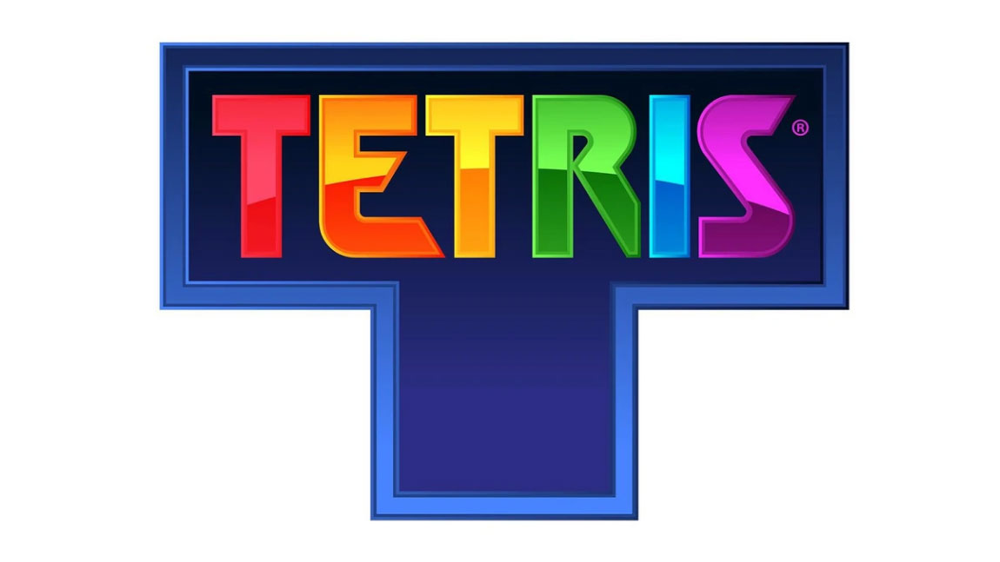
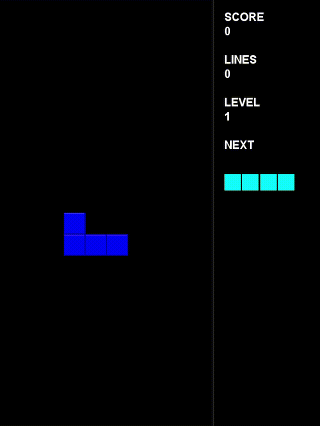

<p align="center">
  
</p>

<p align="center">
  
  
  
</p>

<p align="center">
  A classic Tetris game developed using Java Swing with smooth gameplay, keyboard controls, collision detection, and scoring system.
</p>

---

## Overview

**Tetris Java** is a desktop-based implementation of the classic Tetris game built completely using **Java Swing**.

The project focuses on implementing game development concepts such as:

* Game loops
* Object-oriented programming
* Keyboard event handling
* Collision detection
* Grid-based movement
* Real-time rendering

No external libraries or frameworks are required.

---

##  Features

###  Gameplay

* Classic Tetris mechanics
* Seven Tetromino shapes
* Automatic piece falling
* Left and right movement
* Piece rotation
* Soft drop
* Hard drop
* Line clearing

###  Game Logic

* Collision detection system
* Piece locking mechanism
* Game over detection
* Score calculation
* Restart functionality

###  User Experience

* Java Swing graphical interface
* Pause and resume support
* Keyboard-based controls
* Lightweight application

---

##  Tech Stack

| Technology | Usage             |
| ---------- | ----------------- |
| Java       | Core development  |
| Java Swing | User Interface    |
| Java AWT   | Graphics & Events |
| Git/GitHub | Version Control   |

---

##  Controls

| Key            | Function         |
| -------------- | ---------------- |
| ⬅️ Left Arrow  | Move piece left  |
| ➡️ Right Arrow | Move piece right |
| ⬆️ Up Arrow    | Rotate piece     |
| ⬇️ Down Arrow  | Soft drop        |
| Space          | Hard drop        |
| P              | Pause / Resume   |
| R              | Restart Game     |

---
## Gameplay Video



---

### Prerequisites

Install Java JDK:

```bash
java -version
```

Recommended:

* JDK 17+
* JDK 21+

---

### Clone Repository

```bash
git clone https://github.com/rupeshattarde2808/Tetris-java2.git
```

Navigate into the project:

```bash
cd Tetris-java2
```

---

##  Run The Game

Move into the source directory:

```bash
cd src
```

Compile:

```bash
javac Tetris.java
```

Run:

```bash
java Tetris
```

---

##  Future Enhancements

* [ ] Next piece preview
* [ ] Multiple difficulty levels
* [ ] Sound effects
* [ ] Background music
* [ ] High score saving
* [ ] Improved animations
* [ ] Multiplayer mode

---

##  Contributing

Contributions are welcome!

Steps:

1. Fork the repository
2. Create a new branch

```bash
git checkout -b feature-name
```

3. Commit your changes

```bash
git commit -m "Add new feature"
```

4. Push the branch

```bash
git push origin feature-name
```

5. Open a Pull Request

---

##  License

This project is licensed under the MIT License.

---

##  Author

**Rupesh Attarde**

GitHub:
https://github.com/rupeshattarde2808

---

⭐ If you like this project, consider giving it a star!
