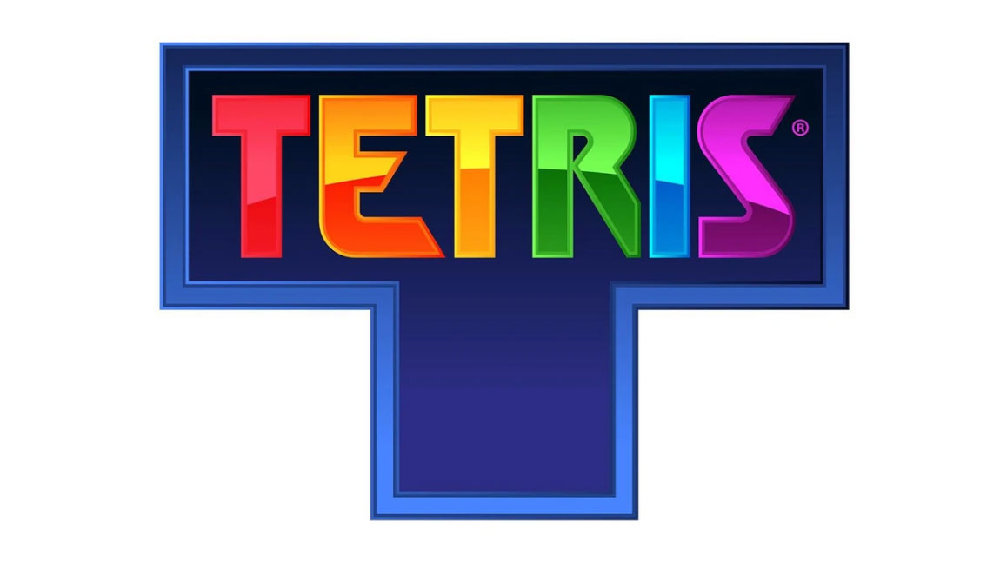
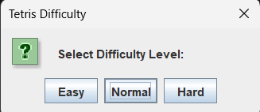
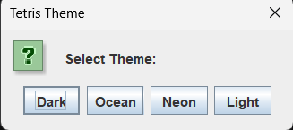
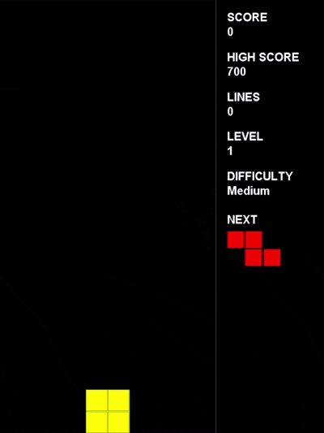

<p align="center">
  
</p>

<p align="center">
  
  
  
</p>

<p align="center">
  A classic Tetris game developed using Java Swing with smooth gameplay, keyboard controls, collision detection, and scoring system,mutiple difficulty level,sound effect,animation and customizable visual themes.
</p>

---

## Overview

A desktop-based **Tetris game** built with Java Swing, featuring multiple difficulty levels,
next-piece preview, persistent high scores, sound effects, background music,Line clearing animation
collision detection, and keyboard controls.

---

##  Features

###  Gameplay

* Classic Tetris mechanics
* Seven Tetromino shapes
* Automatic piece falling
* Left and right movement
* Piece rotation
* Soft drop
* Hard drop
* Line clearing
* Score tracking
* High score saving
* Multiple difficulty level
* Sound effect
* Background music
* Add clearline animation
* Add a pause feature

###  Game Logic

* Collision detection system
* Piece locking mechanism
* Game over detection
* Score calculation
* Restart functionality

###  User Experience

* Java Swing graphical interface
* Pause and resume support
* Keyboard-based controls
* Lightweight application

---

##  Tech Stack

| Technology | Usage |
| ---------- | ----- |
| Java 26 | Core development & game logic |
| Java Swing | Graphical User Interface |
| Java AWT | Graphics, keyboard events & rendering |
| Java Sound API | Sound effects & background music |
| File I/O | Persistent high-score storage |
| Git/GitHub | Version control & project management |
---

##  Controls

| Key            | Function         |
| -------------- | ---------------- |
| ⬅️ Left Arrow  | Move piece left  |
| ➡️ Right Arrow | Move piece right |
| ⬆️ Up Arrow    | Rotate piece     |
| ⬇️ Down Arrow  | Soft drop        |
| Space          | Hard drop        |
| P              | Pause / Resume   |
| R              | Restart Game     |

---

## Difficulty Modes

The game provides three difficulty levels:

| Difficulty | Falling Speed |
|------------|---------------|
| Easy       | Slow          |
| Medium     | Normal        |
| Hard       | Fast          |

The difficulty level affects how quickly Tetromino pieces fall.

---

## Difficulty selection 

<p align="center">
  
</p>

---

## Themes

The game includes four built-in visual themes:

| Theme | Description |
|-------|-------------|
| Dark  | Classic dark Tetris appearance |
| Ocean | Blue-based visual theme |
| Neon  | Bright neon-style interface |
| Light | Light background with dark text |

The theme can be selected when starting the game.

---

## Theme selection 

<p align="center">
  
</p>

---

## Scoring System

Points are awarded based on the number of lines cleared:

| Lines Cleared | Base Score |
|---------------|------------|
| 1 Line        | 100        |
| 2 Lines       | 300        |
| 3 Lines       | 500        |
| 4 Lines       | 800        |

The score is multiplied by the current level.

Additional points can also be earned by performing hard drops.

---

## Gameplay Video



---

### Prerequisites

Install Java JDK:

```bash
java -version
```

Recommended:

- JDK 26
- Git

---

### Clone Repository

```bash
git clone https://github.com/rupeshattarde2808/Tetris-java2.git
```

Navigate into the project:

```bash
cd Tetris-java2
```

---

##  Run The Game

Move into the source directory:

```bash
cd src
```

Compile:

```bash
javac Tetris.java
```

Run:

```bash
java Tetris
```

---

##  Future Enhancements

* [x] Next piece preview
* [x] Multiple difficulty levels
* [x] Sound effects
* [x] Background music
* [x] High score saving
* [x] Improved animations
* [x] pause the game
* [x] Theme selection
* [ ] Multiplayer mode

---

##  Contributing

Contributions are welcome!

Steps:

1. Fork the repository
2. Create a new branch

```bash
git checkout -b feature-name
```

3. Commit your changes

```bash
git commit -m "Add new feature"
```

4. Push the branch

```bash
git push origin feature-name
```

5. Open a Pull Request

---

##  License

This project is licensed under the MIT License.

---

##  Author

**Rupesh Attarde**

GitHub:
https://github.com/rupeshattarde2808

---

⭐ If you like this project, consider giving it a star!
